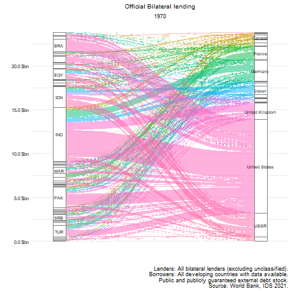

# Who lends to developing countries? 
### WB external debt stock data disaggregated by counterparty.

The dataset assembled can be downloaded [here](data/WB_IDS_2021_final.xlsx)  and the raw file is [here](data/raw_IDS_all_debt_pos.csv) 

A few summary plots from the dataset.
(1)

(2)

(3)

(4)

This data was retrieved from WB IDS API and assembled by David Mihalyi and Balint Parragi		
Source: [WB IDS Statistics 2021](https://datatopics.worldbank.org/debt/ids/)
		
Date: March 2021.		
