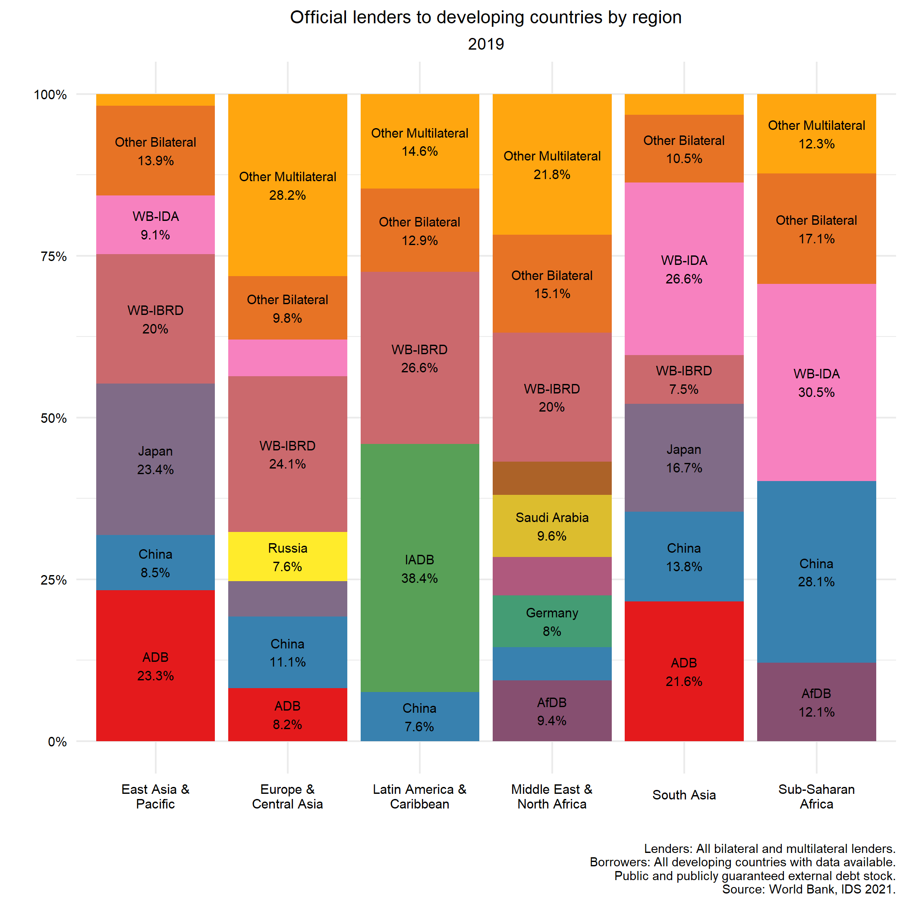
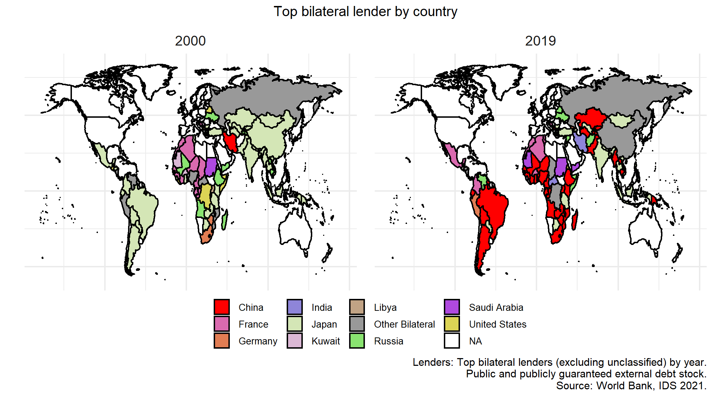
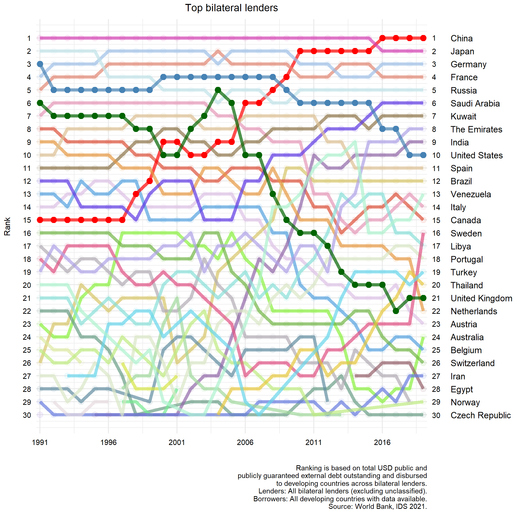

# Who lends to developing countries? 
### WB external debt stock data disaggregated by counterparty.

The dataset assembled can be downloaded [here](https://github.com/davidmihalyi/wb-ids-lenders/raw/main/data/WB_IDS_2021_final.xlsx)  and the raw file is [here](https://github.com/davidmihalyi/wb-ids-lenders/raw/main/data/raw_IDS_all_debt_pos.csv) 

A few summary plots from the dataset.

This data was retrieved from WB IDS API and assembled by David Mihalyi and Balint Parragi.

Source: [WB IDS Statistics 2021](https://datatopics.worldbank.org/debt/ids/)
		
Date: March 2021.		
