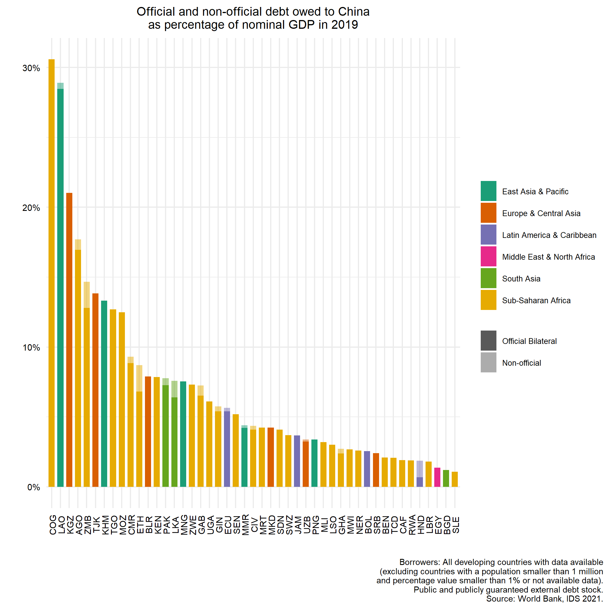

# Who lends to developing countries? 
### WB external debt stock data disaggregated by counterparty.

Update: Updated clean excel with WB IDS 2022 data can be downloaded [here](https://github.com/davidmihalyi/wb-ids-lenders/raw/main/data/WB_IDS_2022_by_lender.xlsx)

The dataset assembled can be downloaded [here](https://github.com/davidmihalyi/wb-ids-lenders/raw/main/data/WB_IDS_2021_by_lender.xlsx)  and the raw file is [here](https://github.com/davidmihalyi/wb-ids-lenders/raw/main/data/raw_IDS_all_debt_pos.csv) 

A few summary plots from the dataset.

This data was retrieved from the WB IDS API and assembled by David Mihalyi and Balint Parragi.
We take no responsibility for the accuracy or correctness of the data.

Source: [WB IDS Statistics 2021](https://datatopics.worldbank.org/debt/ids/)
Date: March 2021.		
